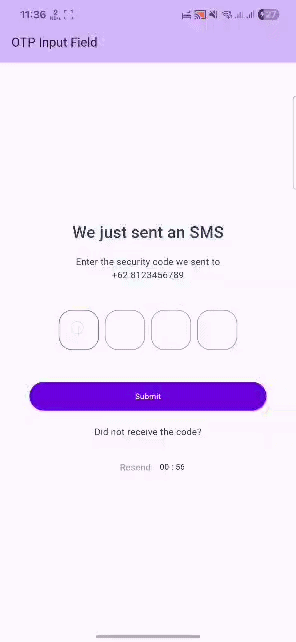

# Flutter OTP UI Demo

A Flutter exploration project demonstrating OTP (One-Time Password) input functionality using the `pinput` package.



## 🎯 Purpose

This project explores implementing a clean and user-friendly OTP input interface with features like countdown timers, resend functionality, and input validation - essential for secure authentication flows in mobile applications.

## 🛠️ Tech Stack

- **Flutter**: Cross-platform mobile development framework
- **Dart**: Programming language
- **pinput**: ^6.0.2 - Pin input field package

## 📱 Demo Features

Basic OTP implementation with:

- **OTP Input Field**: 4-digit pin input with customizable styling
- **Countdown Timer**: 60-second countdown for resend functionality
- **Resend Option**: Disabled during countdown, enabled after timer expires
- **Paste Support**: Can paste OTP directly from clipboard
 

## 📦 Dependencies

```yaml
dependencies:
  flutter:
    sdk: flutter
  cupertino_icons: ^1.0.8
  pinput: ^6.0.2
```

## 🚀 Getting Started

### Prerequisites

- Flutter SDK (>= 3.10.7)
- Dart SDK
- Android Studio / VS Code with Flutter extensions

### Installation

1. Clone the repository:
   ```bash
   git clone <repository-url>
   cd otp_ui
   ```

2. Install dependencies:
   ```bash
   flutter pub get
   ```

3. Run the app:
   ```bash
   flutter run
   ```

### Build for Production

```bash
# Android
flutter build apk

# iOS
flutter build ios
```

## 🏗️ Project Structure

```
lib/
├── main.dart                 # App entry point with OTP UI implementation
```

## 🎨 Customization

### Modifying OTP Length

Change the `length` parameter in the `Pinput` widget:

```dart
Pinput(
  length: 6, // Change from 4 to 6 digits
  // ... other properties
)
```

### Styling Options

Customize the pin appearance by modifying `defaultPinTheme`:

```dart
final defaultPinTheme = PinTheme(
  width: 56,
  height: 56,
  textStyle: TextStyle(
    fontSize: 22,
    color: Color.fromRGBO(30, 60, 87, 1),
  ),
  decoration: BoxDecoration(
    borderRadius: BorderRadius.circular(19),
    border: Border.all(color: Colors.grey),
  ),
);
```

### Timer Configuration

Adjust the countdown duration:

```dart
int _counter = 120; // Change from 59 to 120 seconds
```

## 🔧 Key Features Implementation

### Countdown Timer

```dart
void _startCountdown() {
  _timer = Timer.periodic(const Duration(seconds: 1), (timer) {
    if (_counter > 0) {
      setState(() {
        _counter--;
      });
    } else {
      timer.cancel();
      setState(() {
        _isResendEnabled = true;
      });
    }
  });
}
```

### OTP Input Handling

```dart
Pinput(
  length: 4,
  defaultPinTheme: defaultPinTheme,
  focusedPinTheme: defaultPinTheme.copyWith(
    decoration: BoxDecoration(
      borderRadius: BorderRadius.circular(19),
      border: Border.all(color: Color.fromRGBO(110, 17, 231, 1)),
    ),
  ),
  onCompleted: (pin) {
    log('PIN ENTERED : $pin');
    // Handle OTP verification here
  },
)
```

## 🤝 Contributing

This is a learning project focused on exploring OTP UI implementation. Feel free to fork and modify for your own authentication experiments.

## Credits

This README was written with assistance from [Windsurf](https://windsurf.ai/).
